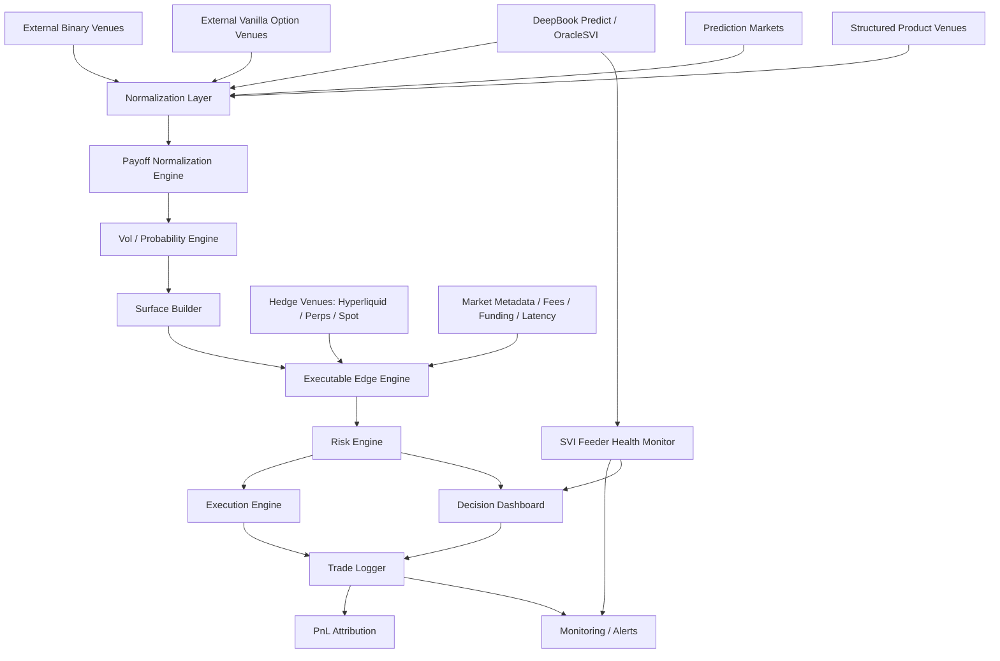
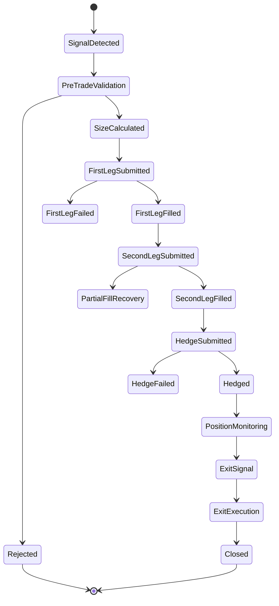
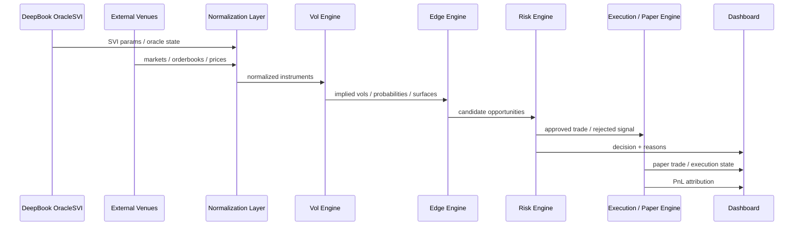

# Universal BTC Vol-Arb Layer for DeepBook Predict

> DeepBook Predict 的通用 BTC 波动率套利与校准层  
> 面向黑客松 MVP、后续实盘研究与多市场扩展的系统设计文档

---

## 0. 文档定位

本文档描述一个围绕 **DeepBook Predict / OracleSVI** 构建的跨市场 BTC 波动率定价系统。

系统目标不是简单做一个 “DeepBook ↔ Polymarket 套利机器人”，而是构建一个更通用的基础设施：

> 将不同市场上的 BTC 二元期权、普通期权、预测市场与结构化收益产品，统一转化为可比较的隐含概率、隐含波动率、风险中性分布与可执行套利评分，从而发现跨市场错价，并反向压力测试 DeepBook Predict 的 SVI 数据质量。

本文档适合作为：

- 黑客松项目 README；
- 开发任务拆解文档；
- 系统架构说明；
- 后续扩展为真实交易系统的技术蓝图；
- Obsidian 项目索引页。

---

## 1. 项目名称

### 英文名

**Universal BTC Vol-Arb Layer for DeepBook Predict**

### 中文名

**DeepBook Predict 通用 BTC 波动率套利与校准层**

### 简短描述

一个将 DeepBook Predict 的 `OracleSVI` 与外部 BTC 期权 / 二元期权 / 预测市场统一到同一套波动率定价框架中的跨市场套利与监控系统。

---

## 2. 核心战略定位

### 2.1 不是单一套利机器人

普通项目可能会做：

```text
DeepBook implied vol = 60%
Polymarket implied vol = 80%
Spread = 20%
```

这只能说明两个市场的理论定价不一致，但不能说明这笔交易一定能做。

本系统更关注：

```text
Raw Vol Spread
- bid/ask spread
- slippage
- fees
- hedge cost
- funding cost
- stale oracle penalty
- execution latency penalty
- settlement mismatch penalty
= Executable Edge After Cost
```

因此，本系统的真正目标是：

> 发现真实可执行、可风控、可解释的跨市场 BTC 波动率错价。

---

### 2.2 不是只支持 Polymarket

Polymarket 只是第一个外部市场适配器。

只要某个市场存在以下产品，就理论上可以被纳入系统：

- BTC 二元期权；
- BTC 普通欧式期权；
- BTC 预测市场；
- BTC 结构化收益产品；
- BTC 波动率产品；
- BTC 区间收益产品；
- BTC 上下方向短期期权；
- BTC 价格门槛事件市场。

系统的核心不是某一个交易所，而是一个 **统一定价与标准化层**。

---

### 2.3 DeepBook Predict 的角色

DeepBook Predict 在本系统中有两个角色：

#### 角色一：交易场所

如果 DeepBook Predict 提供足够稳定的真实成交报价，系统可以把它作为一个可交易 venue。

#### 角色二：波动率参考层

如果 DeepBook Predict 当前流动性不足，系统仍然可以使用 `OracleSVI` 作为理论定价与外部市场校准源。

也就是说，即使暂时无法实盘交易，系统仍然有价值：

> 它可以把 DeepBook 的 `OracleSVI` 转化为可视化、可比较、可监控的全球 BTC 波动率参考曲面。

---

## 3. 总体目标

### 3.1 第一目标：统一不同市场的 BTC 波动率表达

不同市场表达 BTC 风险的方式不同：

| 产品类型 | 表达方式 | 示例 |
|---|---|---|
| 普通 Call Option | 到期价格越高，收益越高 | BTC 5 月 31 日 100000 Call |
| 普通 Put Option | 到期价格越低，收益越高 | BTC 5 月 31 日 90000 Put |
| Binary Option | 到期是否满足条件 | BTC 是否高于 100000 |
| Prediction Market | 用户交易某事件概率 | BTC 是否在月底突破 120000 |
| Range Product | 到期是否落在区间内 | BTC 是否在 90000–110000 区间 |
| Structured Product | 多个收益腿组合 | 保本 + 卖出上行收益 |

系统要做的是：

```text
不同市场产品
→ 统一收益函数 payoff
→ 统一到期时间 expiry
→ 统一执行价格 strike
→ 统一结算规则 settlement
→ 统一 bid / ask / liquidity
→ 转换成 implied probability / implied volatility / fair value
```

---

### 3.2 第二目标：识别真实可执行错价

系统不只计算理论价差，还要判断：

- 是否有足够深度；
- 是否能做空；
- bid/ask 是否过宽；
- 到期时间是否匹配；
- 结算价格来源是否一致；
- oracle 是否过期；
- hedge 成本是否过高；
- 跨市场执行是否可控；
- 单边成交风险是否可接受。

最终输出：

```text
Executable Edge Score
Tradability Score
Risk Score
Confidence Score
Recommended Size
Reject Reason / Trade Reason
```

---

### 3.3 第三目标：压力测试 DeepBook OracleSVI

系统可以监控 `OracleSVI` 是否存在：

- 数据延迟；
- 曲面跳变；
- strike 局部异常；
- expiry 局部异常；
- 与外部市场长期偏离；
- settlement 异常；
- feeder lag；
- stale SVI。

这使系统不只是交易工具，还是 DeepBook Predict 的基础设施监控工具。

---

### 3.4 第四目标：形成可扩展交易基础设施

系统架构必须支持：

- 新增交易场所；
- 新增产品类型；
- 新增对冲场所；
- 从监控面板升级到纸面交易；
- 从纸面交易升级到真实交易；
- 从单一 BTC 扩展到 ETH / SOL / SUI 等资产。

---

## 4. 非目标

当前阶段不追求：

1. 完整高频交易系统；
2. 无风险套利承诺；
3. 完全自动化实盘资金管理；
4. 复杂机器学习预测 BTC 方向；
5. 所有市场的实时接入；
6. 做成面向普通散户的一键赌博产品；
7. 规避任何司法辖区的合规要求。

本系统定位为：

> 研究级、工程化、风控优先的波动率定价与套利基础设施。

---

## 5. 核心概念解释

### 5.1 Volatility，波动率

波动率表示价格未来可能波动的剧烈程度。

价格越可能大涨大跌，波动率越高。

---

### 5.2 Implied Volatility，隐含波动率

隐含波动率不是历史上真实发生的波动，而是从市场价格反推出的未来预期波动。

例如某个 BTC 期权很贵，说明市场认为 BTC 到期前大幅波动的可能性较高。

---

### 5.3 Volatility Smile，波动率微笑

不同 strike 对应不同隐含波动率，画出来可能像一个微笑。

```text
隐含波动率
高 |      *             *
   |    *                 *
低 |          *     *
   +-------------------------
      低 strike   中间   高 strike
```

这反映市场对极端上涨和极端下跌的不同定价。

---

### 5.4 SVI

SVI 是一种描述波动率曲面的参数化模型。

可以把它理解为：

> 用少量参数表示不同 strike、不同 expiry 上的隐含波动率结构。

在 DeepBook Predict 中，`OracleSVI` 是关键数据源之一。

---

### 5.5 Binary Option，二元期权

二元期权只有两个结果：

- 条件成立，获得固定收益；
- 条件不成立，收益为零。

例如：

> BTC 到期是否高于 100000 美元？

---

### 5.6 Vanilla Option，普通期权

普通期权包括 Call 和 Put。

- Call：看涨期权；
- Put：看跌期权。

Call 的收益随到期价格高于 strike 的部分增加。

Put 的收益随到期价格低于 strike 的部分增加。

---

### 5.7 Digital Probability，数字概率

二元期权的价格可以近似理解为市场隐含概率。

例如 YES 价格是 0.25，可以粗略理解为市场认为事件有 25% 概率发生。

实际使用中还需要考虑：

- 风险溢价；
- 手续费；
- bid/ask；
- 流动性；
- 做市商库存风险；
- 结算规则差异。

---

### 5.8 Delta Hedge

Delta hedge 是用永续合约或现货对冲掉价格方向暴露。

目标是让系统收益主要来自波动率错价，而不是 BTC 方向性涨跌。

---

### 5.9 Executable Edge

Executable Edge 是扣除交易成本、滑点、延迟、对冲成本后的真实可交易优势。

这是本系统最重要的指标之一。

---

## 6. 总体系统架构



---

## 7. 核心模块设计

---

## 7.1 Venue Adapter Layer

### 职责

负责接入不同市场，并把原始数据转换为系统内部标准格式。

### 示例 Adapter

```text
DeepBookPredictAdapter
PolymarketAdapter
VanillaOptionVenueAdapter
BinaryOptionVenueAdapter
HyperliquidHedgeAdapter
ManualCsvAdapter
MockVenueAdapter
```

### 每个 Adapter 需要实现的能力

```ts
interface VenueAdapter {
  venueName: string;

  discoverMarkets(params: MarketDiscoveryParams): Promise<RawMarket[]>;

  fetchOrderBook(instrumentId: string): Promise<RawOrderBook>;

  fetchTrades?(instrumentId: string): Promise<RawTrade[]>;

  fetchFundingRate?(symbol: string): Promise<FundingRate>;

  normalize(raw: RawMarket): Promise<NormalizedInstrument>;

  healthCheck(): Promise<VenueHealth>;
}
```

---

## 7.2 Normalization Layer

### 目标

将不同 venue 的产品统一成标准结构。

### 内部标准对象

```ts
type PayoffType =
  | "binary"
  | "call"
  | "put"
  | "range"
  | "spread"
  | "structured";

type NormalizedInstrument = {
  instrumentId: string;
  venue: string;
  underlying: "BTC" | "ETH" | "SUI" | string;

  expiry: number;
  strike?: number;
  lowerStrike?: number;
  upperStrike?: number;

  payoffType: PayoffType;
  direction?: "above" | "below" | "between" | "outside";

  quoteCurrency: string;
  bid: number | null;
  ask: number | null;
  mid: number | null;

  bidSize?: number;
  askSize?: number;
  liquidityScore: number;

  settlementSource: string;
  settlementRule: string;

  timestamp: number;
  confidenceScore: number;

  rawRef?: unknown;
};
```

---

## 7.3 Payoff Normalization Engine

### 职责

把不同产品转换为可计算的 payoff function。

### 标准 payoff 表达

```ts
type PayoffFunction = (spotAtExpiry: number) => number;
```

### 示例

#### Binary Above

```ts
function binaryAbove(strike: number, payout: number): PayoffFunction {
  return (s) => (s > strike ? payout : 0);
}
```

#### Call Option

```ts
function callPayoff(strike: number): PayoffFunction {
  return (s) => Math.max(s - strike, 0);
}
```

#### Put Option

```ts
function putPayoff(strike: number): PayoffFunction {
  return (s) => Math.max(strike - s, 0);
}
```

#### Range Product

```ts
function rangeBinary(lower: number, upper: number, payout: number): PayoffFunction {
  return (s) => (s >= lower && s <= upper ? payout : 0);
}
```

---

## 7.4 Vol / Probability Engine

### 职责

负责从不同市场价格中反推：

- implied probability；
- implied volatility；
- digital fair value；
- option fair value；
- risk-neutral density；
- smile / surface。

### 输入

```text
NormalizedInstrument[]
DeepBook OracleSVI params
Spot price
Forward price
Interest rate / funding assumption
Expiry
Strike
Bid / Ask / Mid
```

### 输出

```ts
type ImpliedPoint = {
  venue: string;
  underlying: string;
  expiry: number;
  strike: number;

  bidIv?: number;
  midIv?: number;
  askIv?: number;

  impliedProbability?: number;
  fairBinaryPrice?: number;
  fairOptionPrice?: number;

  confidenceScore: number;
  timestamp: number;
};
```

### 核心能力

1. Evaluate DeepBook SVI；
2. 从普通期权价格反推 implied vol；
3. 从 binary price 反推 digital probability；
4. 从 vanilla option chain 推出 digital fair value；
5. 构建 bid / mid / ask 三条 smile；
6. 对齐 expiry；
7. 处理 strike interpolation；
8. 输出异常点。

---

## 7.5 Surface Builder

### 职责

按 venue / expiry 构建波动率曲面。

```text
Venue A:
  Expiry 1:
    Strike 1 -> IV
    Strike 2 -> IV
    Strike 3 -> IV
  Expiry 2:
    Strike 1 -> IV
    Strike 2 -> IV

Venue B:
  ...
```

### 输出

```ts
type VolSurface = {
  venue: string;
  underlying: string;
  expiry: number;
  points: ImpliedPoint[];
  surfaceQualityScore: number;
  staleScore: number;
  lastUpdatedAt: number;
};
```

### 质量指标

- strike 覆盖度；
- expiry 匹配度；
- bid/ask 宽度；
- 流动性深度；
- 数据新鲜度；
- 曲面平滑程度；
- 异常点数量；
- 与外部 reference 的偏离程度。

---

## 7.6 Executable Edge Engine

### 职责

判断理论价差是否是真实可交易机会。

### 输入

```text
DeepBook SVI fair value
External venue bid / ask
Orderbook depth
Fee model
Slippage model
Hedge cost
Funding cost
Latency model
Settlement mismatch score
```

### 输出

```ts
type ExecutableEdge = {
  opportunityId: string;

  sourceVenue: string;
  targetVenue: string;
  hedgeVenue?: string;

  underlying: string;
  expiry: number;
  strike?: number;

  rawVolSpread: number;
  bidAskAdjustedSpread: number;
  feeAdjustedSpread: number;
  hedgeAdjustedSpread: number;
  latencyAdjustedSpread: number;
  finalExecutableEdge: number;

  recommendedSizeUsd: number;
  maxSizeUsd: number;

  confidenceScore: number;
  riskScore: number;
  tradabilityScore: number;

  decision: "trade" | "watch" | "reject";
  rejectReasons?: string[];

  timestamp: number;
};
```

### 关键原则

系统不应该报告虚假的 midpoint arbitrage。

必须基于：

```text
bid / ask adjusted edge
而不是 midpoint spread
```

例如：

```text
Polymarket bid IV = 70%
Polymarket ask IV = 90%
DeepBook IV = 82%
```

虽然 mid 可能显示有差异，但 DeepBook IV 位于外部市场 bid/ask 区间内，不一定可交易。

---

## 7.7 Risk Engine

### 职责

负责交易前、交易中、交易后的风险控制。

### 核心风控项

```text
1. SVI feeder lag 风控
2. Stale data 风控
3. 最大单笔 notional
4. 最大单 venue exposure
5. 最大未对冲 delta
6. 最大 expiry concentration
7. 最大单日亏损
8. 最大连续亏损次数
9. 最大 partial-fill 暴露
10. 最大 hedge slippage
11. 最小 executable edge
12. 最小 liquidity score
13. 最小 confidence score
14. 最短 / 最长可交易 expiry
```

### Kill Switch

```ts
type KillSwitchRule = {
  name: string;
  condition: string;
  action: "pause_opening" | "reduce_only" | "full_stop";
  severity: "low" | "medium" | "high" | "critical";
};
```

### 示例规则

```text
如果 SVI feeder lag > 120 秒：full_stop
如果 Polymarket spread > 15%：reject trade
如果 Hyperliquid hedge slippage > edge 的 50%：reject trade
如果 net delta exposure > limit：reduce_only
如果 oracle jump > 5 sigma：pause_opening
如果 daily loss > 2% capital：full_stop
```

---

## 7.8 Execution Engine

### 阶段定位

黑客松 MVP 阶段建议先做：

```text
Paper Execution
而不是真实全自动交易
```

后续再升级为：

```text
Live Execution
```

### 执行状态机



### 执行模式

```ts
type ExecutionMode =
  | "monitor_only"
  | "paper_trade"
  | "manual_confirm"
  | "semi_auto"
  | "full_auto";
```

### 黑客松建议

优先做：

```text
monitor_only + paper_trade
```

不要一开始做：

```text
full_auto real money execution
```

---

## 7.9 Hedge Engine

### 目标

使用永续合约或现货对冲 BTC 方向性风险，使 PnL 尽量来自波动率错价。

### 关键变量

```text
delta
hedge ratio
hedge interval
no-hedge band
funding rate
slippage
basis
position size
```

### 输出

```ts
type HedgePlan = {
  hedgeVenue: string;
  symbol: string;
  side: "long" | "short";
  quantity: number;
  estimatedSlippage: number;
  estimatedFundingCost: number;
  hedgeConfidence: number;
};
```

### 注意事项

Binary option 的 delta 在接近 strike 和临近 expiry 时可能非常尖锐。

因此需要：

```text
delta cap
no-hedge band
minimum hedge interval
expiry cutoff
max hedge turnover
```

---

## 7.10 SVI Feeder Health Monitor

### 职责

监控 DeepBook `OracleSVI` 的数据质量。

### 监控指标

```text
1. last update time
2. feeder lag
3. spot jump
4. forward jump
5. SVI parameter jump
6. strike-level abnormality
7. expiry-level abnormality
8. surface smoothness
9. external market deviation
10. stale score
```

### 输出

```ts
type SviHealthReport = {
  oracleId: string;
  underlying: string;
  expiry: number;

  lastUpdatedAt: number;
  lagSeconds: number;
  staleScore: number;

  surfaceJumpScore: number;
  externalDeviationScore: number;
  abnormalPoints: number;

  status: "healthy" | "warning" | "stale" | "critical";
  reasons: string[];
};
```

### 价值

该模块可以让项目从普通套利系统升级为：

> DeepBook Predict 的实时风险监控与外部市场校准工具。

---

## 7.11 PnL Attribution

### 职责

拆解每笔交易的收益来源。

### 拆解维度

```text
1. Vol edge PnL
2. Delta PnL
3. Hedge PnL
4. Funding PnL
5. Fee cost
6. Slippage cost
7. Execution mismatch cost
8. Oracle update impact
9. Residual exposure PnL
```

### 输出

```ts
type PnlAttribution = {
  tradeId: string;

  totalPnl: number;
  volEdgePnl: number;
  deltaPnl: number;
  hedgePnl: number;
  fundingPnl: number;
  fees: number;
  slippage: number;
  executionMismatch: number;
  residualRiskPnl: number;

  explanation: string;
};
```

### 目的

证明系统收益不是单纯来自 BTC 方向性暴露，而是来自真正的波动率错价。

---

## 8. 数据流设计



---

## 9. MVP 范围

### 9.1 推荐黑客松 MVP

项目第一版不要做完整三市场实盘机器人，而是做：

> **DeepBook Predict Vol-Arb Intelligence Terminal**

包含以下功能：

```text
1. DeepBook OracleSVI Viewer
2. Polymarket BTC Binary Market Parser
3. Normalized Instrument Table
4. Bid / Ask Aware Implied Vol Smile
5. DeepBook SVI vs External Market Surface Comparison
6. Executable Edge Calculator
7. SVI Feeder Health Dashboard
8. Paper Trading Simulator
9. Risk / Kill Switch Dashboard
10. PnL Attribution Demo
```

---

### 9.2 MVP 不做的内容

```text
1. 不做真实资金全自动交易
2. 不接入所有外部期权市场
3. 不做复杂 ML 方向预测
4. 不做普通用户一键下注应用
5. 不承诺无风险套利
6. 不支持复杂结构化产品实盘发行
```

---

## 10. 后续版本路线图

### V0：Research Dashboard

目标：只监控，不交易。

功能：

```text
DeepBook SVI 读取
外部市场读取
expiry / strike 对齐
smile 展示
raw spread 展示
stale data 标记
```

时间预估：1–2 周。

---

### V1：Executable Edge Monitor

目标：从理论价差升级为真实可交易评分。

功能：

```text
bid/ask adjusted spread
fee adjusted spread
liquidity score
confidence score
reject reason
SVI health score
```

时间预估：2–4 周。

---

### V2：Paper Trading System

目标：模拟交易闭环。

功能：

```text
paper order
simulated fill
position tracking
PnL attribution
risk limits
kill switch simulation
```

时间预估：3–6 周。

---

### V3：Semi-Automated Execution

目标：人确认后执行。

功能：

```text
manual confirm
venue order preview
transaction builder
post-trade reconciliation
hedge recommendation
```

时间预估：6–10 周。

---

### V4：Live Trading Bot

目标：小资金自动化实盘。

功能：

```text
live execution
partial fill recovery
auto hedge
capital allocation
venue failure handling
real-time alerts
```

时间预估：8–12 周以上。

---

### V5：Universal Multi-Venue Vol Layer

目标：扩展到多个外部期权 / 二元期权 venue。

功能：

```text
multi-venue adapter registry
multi-asset support
cross-venue routing
portfolio-level risk
capital optimization
production monitoring
```

时间预估：长期项目。

---

## 11. 前端 Dashboard 设计

### 11.1 页面一：Overview

展示：

```text
当前 BTC spot
DeepBook SVI status
外部市场数量
有效 expiry 数量
当前最大 executable edge
系统风险状态
kill switch 状态
```

---

### 11.2 页面二：Vol Surface Comparison

展示：

```text
DeepBook SVI smile
External venue bid smile
External venue mid smile
External venue ask smile
spread heatmap
```

---

### 11.3 页面三：Opportunity Table

字段：

```text
venue pair
expiry
strike
raw spread
executable edge
liquidity score
confidence score
risk score
recommended size
decision
reject reason
```

---

### 11.4 页面四：SVI Feeder Health

字段：

```text
oracle id
expiry
last update
lag seconds
surface jump score
external deviation
status
reason
```

---

### 11.5 页面五：Paper Trading

字段：

```text
signal time
entry price
simulated fill
hedge plan
current PnL
PnL attribution
exit reason
```

---

### 11.6 页面六：Risk Control

字段：

```text
max notional
max delta exposure
daily loss limit
venue exposure
kill switch rules
active alerts
```

---

## 12. 后端服务设计

### 12.1 服务拆分

```text
market-data-service
normalization-service
vol-engine-service
edge-engine-service
risk-service
paper-execution-service
svi-health-service
pnl-service
api-gateway
```

黑客松阶段不必拆成生产级微服务，但应使用 monorepo 保留清晰边界：

```text
apps/web
apps/api
packages/core
packages/adapters
packages/config
```

这样既能快速交付，也不会把 UI、API、定价逻辑和 venue adapter 混在一起。

---

### 12.2 推荐技术栈

#### 前端

```text
Next.js / React
TypeScript
TailwindCSS
Recharts / Lightweight Charts
Sui Wallet Kit
```

#### 后端

```text
Node.js / TypeScript
Python for quant engine optional
PostgreSQL
Redis optional
WebSocket / SSE
```

#### 链上交互

```text
Sui TypeScript SDK
DeepBook Predict package interface
Polymarket CLOB API
Hyperliquid API
```

#### 计算模块

```text
TypeScript first
Python optional for IV solver / SVI / surface fitting
```

---

## 13. 数据存储设计

### 13.1 Market Snapshot

```sql
CREATE TABLE market_snapshots (
  id TEXT PRIMARY KEY,
  venue TEXT NOT NULL,
  instrument_id TEXT NOT NULL,
  underlying TEXT NOT NULL,
  expiry BIGINT NOT NULL,
  strike DOUBLE PRECISION,
  payoff_type TEXT NOT NULL,
  bid DOUBLE PRECISION,
  ask DOUBLE PRECISION,
  mid DOUBLE PRECISION,
  bid_size DOUBLE PRECISION,
  ask_size DOUBLE PRECISION,
  liquidity_score DOUBLE PRECISION,
  confidence_score DOUBLE PRECISION,
  timestamp BIGINT NOT NULL
);
```

---

### 13.2 Vol Points

```sql
CREATE TABLE vol_points (
  id TEXT PRIMARY KEY,
  venue TEXT NOT NULL,
  underlying TEXT NOT NULL,
  expiry BIGINT NOT NULL,
  strike DOUBLE PRECISION NOT NULL,
  bid_iv DOUBLE PRECISION,
  mid_iv DOUBLE PRECISION,
  ask_iv DOUBLE PRECISION,
  implied_probability DOUBLE PRECISION,
  confidence_score DOUBLE PRECISION,
  timestamp BIGINT NOT NULL
);
```

---

### 13.3 Opportunities

```sql
CREATE TABLE opportunities (
  id TEXT PRIMARY KEY,
  source_venue TEXT NOT NULL,
  target_venue TEXT NOT NULL,
  underlying TEXT NOT NULL,
  expiry BIGINT NOT NULL,
  strike DOUBLE PRECISION,
  raw_vol_spread DOUBLE PRECISION,
  executable_edge DOUBLE PRECISION,
  recommended_size_usd DOUBLE PRECISION,
  confidence_score DOUBLE PRECISION,
  risk_score DOUBLE PRECISION,
  decision TEXT NOT NULL,
  reject_reasons JSONB,
  timestamp BIGINT NOT NULL
);
```

---

### 13.4 SVI Health Reports

```sql
CREATE TABLE svi_health_reports (
  id TEXT PRIMARY KEY,
  oracle_id TEXT NOT NULL,
  underlying TEXT NOT NULL,
  expiry BIGINT NOT NULL,
  last_updated_at BIGINT NOT NULL,
  lag_seconds DOUBLE PRECISION,
  stale_score DOUBLE PRECISION,
  surface_jump_score DOUBLE PRECISION,
  external_deviation_score DOUBLE PRECISION,
  status TEXT NOT NULL,
  reasons JSONB,
  timestamp BIGINT NOT NULL
);
```

---

## 14. API 设计

### 14.1 获取 Overview

```http
GET /api/overview
```

返回：

```json
{
  "btcSpot": 100000,
  "systemStatus": "healthy",
  "deepbookSviStatus": "warning",
  "activeVenues": 3,
  "validExpiries": 5,
  "maxExecutableEdge": 0.041,
  "killSwitchActive": false
}
```

---

### 14.2 获取波动率曲面

```http
GET /api/surfaces?underlying=BTC&expiry=1770000000
```

---

### 14.3 获取套利机会

```http
GET /api/opportunities?underlying=BTC&minEdge=0.02
```

---

### 14.4 获取 SVI 健康状态

```http
GET /api/svi-health
```

---

### 14.5 创建纸面交易

```http
POST /api/paper-trades
```

请求：

```json
{
  "opportunityId": "opp_123",
  "sizeUsd": 1000,
  "mode": "paper_trade"
}
```

---

## 15. 策略逻辑

### 15.1 基础流程

```text
1. 拉取 DeepBook OracleSVI
2. 拉取外部市场 orderbook
3. 标准化 instrument
4. 构建 vol / probability surface
5. 对齐 expiry / strike
6. 计算 raw spread
7. 扣除 bid/ask / fees / slippage / hedge cost
8. 计算 executable edge
9. 风控过滤
10. 输出 trade / watch / reject
11. 纸面交易或人工确认
12. 记录 PnL attribution
```

---

### 15.2 Opportunity Decision Logic

```ts
function decideOpportunity(edge: ExecutableEdge): "trade" | "watch" | "reject" {
  if (edge.finalExecutableEdge <= 0) return "reject";
  if (edge.confidenceScore < 0.7) return "reject";
  if (edge.riskScore > 0.6) return "reject";
  if (edge.tradabilityScore < 0.7) return "watch";
  if (edge.finalExecutableEdge > 0.03) return "trade";
  return "watch";
}
```

---

## 16. 风险与异常处理

### 16.1 主要风险

| 风险 | 描述 | 缓解方案 |
|---|---|---|
| SVI stale | DeepBook SVI 数据过期 | lag 检测、降仓、暂停开仓 |
| 外部市场文本解析错误 | Polymarket 等市场描述不标准 | confidence score、人工 whitelist |
| Bid/ask 过宽 | 理论价差不可成交 | 使用 bid/ask-adjusted edge |
| Partial fill | 多市场交易只成交一边 | 状态机、取消、hedge、recovery |
| Hedge failure | 对冲失败 | hedge fallback、降低仓位 |
| Delta jump | binary 接近 strike 时 delta 剧烈变化 | delta cap、no-hedge band |
| Funding cost | 永续资金费侵蚀收益 | funding-adjusted edge |
| Settlement mismatch | 不同市场结算价格来源不同 | settlement score、过滤 |
| 监管风险 | 二元期权 / 预测市场监管敏感 | demo / testnet / research mode |

---

### 16.2 Reject Reasons

系统必须能解释为什么不交易。

示例：

```text
Opportunity rejected:
- Polymarket bid/ask spread too wide
- DeepBook SVI stale by 96 seconds
- Settlement source mismatch
- Hedge cost exceeds 60% of edge
- Liquidity below minimum threshold
- Kelly size below minimum trade size
```

这对于评委、用户和未来实盘风控都非常重要。

---

## 17. 仓位管理

### 17.1 基础仓位公式

黑客松阶段可以用简化版：

```text
recommended_size = capital * base_fraction * confidence_score * tradability_score * risk_adjustment
```

---

### 17.2 Kelly Fraction

后续可引入 Kelly fraction。

实际使用不建议 full Kelly，而是：

```text
1/4 Kelly
1/8 Kelly
1/10 Kelly
```

以避免模型误差导致过度下注。

---

### 17.3 仓位上限

建议默认：

```text
单笔最大仓位 <= 1% capital
单 venue 最大暴露 <= 10% capital
单 expiry 最大暴露 <= 20% capital
未对冲 delta <= 设定阈值
```

---

## 18. 黑客松展示策略

### 18.1 一句话 Pitch

英文：

> We turn DeepBook OracleSVI into a universal BTC volatility reference layer, normalize external binary and option markets into comparable volatility surfaces, and surface only bid/ask-adjusted, risk-filtered, executable arbitrage opportunities.

中文：

> 我们把 DeepBook 的 OracleSVI 变成一个通用 BTC 波动率参考层，将外部二元期权、普通期权和预测市场统一成可比较的波动率曲面，只输出扣除交易成本、流动性和风控后的真实可执行套利机会。

---

### 18.2 评委最容易理解的展示路径

```text
1. 展示 DeepBook SVI smile
2. 展示 Polymarket / 外部市场 smile
3. 展示 raw spread
4. 展示 bid/ask 后价差大幅缩水
5. 展示 executable edge
6. 展示为什么某些机会被拒绝
7. 展示 SVI feeder health
8. 展示 paper trade 和 PnL attribution
```

---

### 18.3 竞争优势表达

普通竞品：

> 我发现 DeepBook 和 Polymarket 有价差。

本项目：

> 我判断这个价差是否真实、是否能成交、是否能对冲、是否值得交易，并且能反向监控 DeepBook SVI 数据质量。

---

## 19. 开发任务拆解

### Phase 1：数据接入

```text
[ ] DeepBook OracleSVI adapter
[ ] Polymarket market discovery
[ ] Polymarket orderbook parser
[ ] BTC market filter
[ ] expiry / strike extraction
[ ] normalized instrument schema
```

---

### Phase 2：定价引擎

```text
[ ] SVI evaluator
[ ] binary implied probability calculator
[ ] binary implied vol solver
[ ] vanilla option IV solver
[ ] smile builder
[ ] bid / ask surface builder
```

---

### Phase 3：机会识别

```text
[ ] expiry matching
[ ] strike matching / interpolation
[ ] raw spread calculation
[ ] bid/ask adjusted edge
[ ] fee-adjusted edge
[ ] liquidity score
[ ] confidence score
[ ] decision engine
```

---

### Phase 4：风控与监控

```text
[ ] SVI lag monitor
[ ] stale score
[ ] kill switch rules
[ ] reject reason generator
[ ] risk score
[ ] alert system
```

---

### Phase 5：Dashboard

```text
[ ] Overview page
[ ] Vol surface chart
[ ] Opportunity table
[ ] SVI health page
[ ] Paper trading page
[ ] Risk dashboard
```

---

### Phase 6：Paper Trading

```text
[ ] paper order model
[ ] simulated fill
[ ] position tracking
[ ] hedge simulator
[ ] PnL attribution
[ ] trade log
```

---

## 20. 推荐目录结构

```text
universal-btc-vol-arb/
  apps/
    web/
      src/
        pages/
        components/
        charts/
        hooks/
    api/
      src/
        routes/
        services/
        workers/

  packages/
    adapters/
      src/
        deepbook/
        polymarket/
        hyperliquid/
        mock/
    core/
      src/
        types/
        normalization/
        payoff/
        vol/
        surface/
        edge/
        risk/
        pnl/
    db/
      src/
        schema/
        migrations/
    config/

  scripts/
    fetch-markets.ts
    run-paper-bot.ts
    backfill-snapshots.ts

  docs/
    architecture.md
    pricing.md
    risk.md
    adapters.md
    roadmap.md

  README.md
  package.json
  tsconfig.json
```

---

## 21. 关键成功指标

### 黑客松成功指标

```text
1. 能展示 DeepBook SVI 曲面
2. 能解析至少一个外部 BTC 二元市场
3. 能构建 bid / mid / ask smile
4. 能输出 executable edge
5. 能解释 reject reason
6. 能展示 SVI feeder health
7. 能跑 paper trade demo
8. 能拆解 PnL attribution
```

---

### 后续实盘研究指标

```text
1. 机会命中率
2. 平均 executable edge
3. edge decay speed
4. fill success rate
5. hedge slippage
6. funding cost impact
7. stale SVI false signal rate
8. PnL attribution 中 vol edge 占比
9. max drawdown
10. kill switch 触发次数
```

---

## 22. 合规与免责声明

该系统涉及二元期权、预测市场、期权、永续合约和自动化交易等高风险领域。

系统文档和代码应明确声明：

```text
This project is for research, analytics, simulation, and developer tooling purposes only.
It does not constitute investment advice, legal advice, or a recommendation to trade.
Any live deployment must undergo legal, compliance, security, and risk review.
```

中文：

> 本项目仅用于研究、分析、模拟交易和开发者工具展示，不构成投资建议、法律建议或交易推荐。任何真实资金部署都必须经过法律、合规、安全和风控审查。

---

## 23. 最终总结

本系统的核心价值不是简单发现 DeepBook 和某个市场之间的价差，而是建立一个更通用的波动率标准化与套利基础设施。

它要解决的问题是：

```text
不同市场、不同产品、不同结算规则、不同流动性条件下，
如何把 BTC 风险定价统一到一个可比较、可执行、可风控的框架中？
```

最终项目可以形成三个层次的价值：

### 第一层：交易价值

发现跨市场 BTC 波动率错价。

### 第二层：基础设施价值

把 DeepBook `OracleSVI` 变成外部可验证、可监控、可校准的波动率参考层。

### 第三层：生态价值

帮助 DeepBook Predict 发现 feeder lag、曲面异常、流动性缺口和外部市场偏离，成为 DeepBook 生态中的风险监控与定价基础设施。

最终定位：

> **Universal BTC Vol-Arb Layer for DeepBook Predict：一个面向 DeepBook Predict 的通用 BTC 波动率套利、校准与风控层。**

---

## 24. Goal-Ready Implementation Spec

本节用于把前面的系统蓝图收敛成可交给 `/goal` 自动执行的工程规格。

前文描述的是长期系统；本节定义第一版必须完成、可以验证、不会依赖真实资金的 MVP。

### 24.1 第一版交付物

第一版交付物是一个本地可运行的 Web 应用：

> **DeepBook Predict Vol-Arb Intelligence Terminal**

它必须能在浏览器中展示一个完整的研究型交易终端 demo，包含：

```text
1. Overview
2. Vol Surface Comparison
3. Opportunity Table
4. SVI Feeder Health
5. Paper Trading
6. Risk Control
```

第一版可以使用 mock data，但代码结构必须保留真实 adapter 接入位置。

### 24.2 第一版固定技术栈

为了减少实现歧义，第一版固定使用：

```text
Monorepo workspace
apps/web: Next.js App Router + TypeScript + TailwindCSS + Recharts + lucide-react
apps/api: Node.js + TypeScript HTTP API
packages/core: pricing / SVI / edge / risk / paper trading logic
packages/adapters: mock / DeepBook / Polymarket adapter boundaries
packages/config: shared config and constants
crates/vol-engine: optional Rust quant engine scaffold
本地内存数据源 / deterministic mock fixtures
```

第一版不要求：

```text
PostgreSQL
Redis
真实 DeepBook 链上读取
真实 Polymarket 下单
真实 Hyperliquid 对冲
钱包连接
生产级后台 worker
Rust engine 接入主路径
真实资金交易
```

### 24.3 推荐项目结构

如果当前目录还没有应用代码，按以下结构创建：

```text
.
  package.json
  pnpm-workspace.yaml
  turbo.json
  tsconfig.json
  .gitignore
  .env.example
  apps/
    web/
      package.json
      next.config.ts
      postcss.config.mjs
      tailwind.config.ts
      app/
        layout.tsx
        page.tsx
        globals.css
      components/
        dashboard/
          overview.tsx
          surface-comparison.tsx
          opportunity-table.tsx
          svi-health.tsx
          paper-trading.tsx
          risk-control.tsx
        ui/
      lib/
        api-client.ts
    api/
      package.json
      tsconfig.json
      src/
        index.ts
        routes/
          overview.ts
          surfaces.ts
          opportunities.ts
          svi-health.ts
          paper-trades.ts
        services/
          dashboard-service.ts
          paper-trade-service.ts
  packages/
    core/
      package.json
      tsconfig.json
      src/
        types.ts
        payoff.ts
        svi.ts
        pricing.ts
        surface.ts
        edge.ts
        risk.ts
        paper-trading.ts
        index.ts
    adapters/
      package.json
      tsconfig.json
      src/
        mock/
          mock-adapter.ts
          mock-market-data.ts
        deepbook/
          deepbook-adapter.ts
        polymarket/
          polymarket-adapter.ts
        index.ts
    config/
      package.json
      src/
        constants.ts
        index.ts
  crates/
    vol-engine/
      Cargo.toml
      src/
        lib.rs
        main.rs
  docs/
    architecture.md
    demo-script.md
    security.md
```

### 24.4 MVP 数据策略

MVP 默认使用 deterministic mock data。

Mock 数据必须覆盖：

```text
1. BTC spot
2. DeepBook SVI 参数
3. 至少 3 个 expiry
4. 每个 expiry 至少 7 个 strike
5. 外部 binary market bid / ask / mid
6. 至少 8 个 opportunity
7. 至少 3 个 reject reason
8. 至少 1 个 trade opportunity
9. 至少 1 个 watch opportunity
10. 至少 1 个 stale / warning SVI health report
11. 至少 2 条 paper trade 记录
12. 至少 5 条 risk / kill switch rule
```

Mock 数据应设计成能讲清楚系统逻辑，而不是随机数字。

推荐场景：

```text
Case A:
DeepBook SVI 与外部市场接近，bid/ask 后无套利，decision = reject

Case B:
外部市场 mid 看似有价差，但 bid/ask 太宽，decision = reject

Case C:
扣除 fee / hedge / latency 后仍有正 edge，decision = trade

Case D:
SVI 数据 stale，所有新交易暂停，decision = reject / watch
```

### 24.5 核心类型约束

代码中至少定义以下类型：

```ts
export type PayoffType =
  | "binary"
  | "call"
  | "put"
  | "range"
  | "spread"
  | "structured";

export type NormalizedInstrument = {
  instrumentId: string;
  venue: string;
  underlying: string;
  expiry: number;
  strike?: number;
  lowerStrike?: number;
  upperStrike?: number;
  payoffType: PayoffType;
  direction?: "above" | "below" | "between" | "outside";
  quoteCurrency: string;
  bid: number | null;
  ask: number | null;
  mid: number | null;
  bidSize?: number;
  askSize?: number;
  liquidityScore: number;
  settlementSource: string;
  settlementRule: string;
  timestamp: number;
  confidenceScore: number;
};

export type ExecutableEdge = {
  opportunityId: string;
  sourceVenue: string;
  targetVenue: string;
  hedgeVenue?: string;
  underlying: string;
  expiry: number;
  strike?: number;
  rawVolSpread: number;
  bidAskAdjustedSpread: number;
  feeAdjustedSpread: number;
  hedgeAdjustedSpread: number;
  latencyAdjustedSpread: number;
  finalExecutableEdge: number;
  recommendedSizeUsd: number;
  maxSizeUsd: number;
  confidenceScore: number;
  riskScore: number;
  tradabilityScore: number;
  decision: "trade" | "watch" | "reject";
  rejectReasons?: string[];
  timestamp: number;
};
```

### 24.6 MVP 定价与评分规则

第一版允许使用简化模型，但必须显式、可解释。

最低要求：

```text
1. mid = (bid + ask) / 2
2. binary implied probability = binary mid price
3. DeepBook fair binary price 由 SVI / normal approximation 估算
4. raw spread = external mid implied vol - DeepBook implied vol
5. bid/ask adjusted spread 必须用可成交价格计算
6. final executable edge 必须扣除 fee、slippage、hedge cost、latency penalty
7. decision 必须来自 deterministic rule，不允许纯展示假数据
```

建议使用以下决策逻辑：

```ts
export function decideOpportunity(edge: ExecutableEdge): "trade" | "watch" | "reject" {
  if (edge.finalExecutableEdge <= 0) return "reject";
  if (edge.confidenceScore < 0.7) return "reject";
  if (edge.riskScore > 0.6) return "reject";
  if (edge.tradabilityScore < 0.7) return "watch";
  if (edge.finalExecutableEdge > 0.03) return "trade";
  return "watch";
}
```

### 24.7 API 验收契约

`apps/api` 至少提供以下 API，并返回 JSON。

`apps/web` 不应直接读取 mock fixtures；它必须通过 API client 调用 `apps/api`，这样 MVP 从第一天就是前后端分离结构。

```text
GET /api/overview
GET /api/surfaces
GET /api/opportunities
GET /api/svi-health
POST /api/paper-trades
GET /api/health
```

`GET /api/overview` 必须返回：

```json
{
  "btcSpot": 100000,
  "systemStatus": "healthy",
  "deepbookSviStatus": "warning",
  "activeVenues": 2,
  "validExpiries": 3,
  "maxExecutableEdge": 0.041,
  "killSwitchActive": false
}
```

字段值可以不同，但字段名必须存在。

### 24.8 UI 验收标准

首页必须是实际 dashboard，而不是 landing page。

UI 必须满足：

```text
1. 首屏能看到系统状态、BTC spot、max executable edge、SVI status
2. 能切换或滚动查看 6 个主要模块
3. Vol Surface Comparison 至少展示 DeepBook、external bid、external mid、external ask
4. Opportunity Table 必须显示 trade / watch / reject
5. reject opportunity 必须能看到 reject reason
6. SVI Health 必须显示 healthy / warning / stale / critical 中至少两种状态
7. Paper Trading 必须显示模拟持仓和 PnL attribution
8. Risk Control 必须显示 kill switch rules 和 active alerts
9. 页面在桌面宽度和移动宽度下不能出现明显文字重叠
10. 页面视觉风格应偏专业交易终端，不做营销型 hero
```

### 24.9 验收命令

实现完成后至少运行：

```text
pnpm install
npm run lint
npm run build
npm run dev
curl http://localhost:4000/api/overview
curl http://localhost:4000/api/health
```

推荐端口：

```text
apps/web: http://localhost:3000
apps/api: http://localhost:4000
```

根目录 scripts 应至少包含：

```json
{
  "scripts": {
    "dev": "turbo dev",
    "build": "turbo build",
    "lint": "turbo lint",
    "typecheck": "turbo typecheck"
  }
}
```

如果不用 pnpm / turbo，必须在最终说明中解释替代选择，并保持 monorepo 结构。

前端完成后应通过浏览器打开本地地址进行视觉检查。

### 24.10 明确禁止项

第一版不得实现：

```text
1. 真实资金下单
2. 自动连接交易所 API key
3. 自动签名链上交易
4. 承诺无风险收益
5. 面向散户下注的文案
6. 绕过地理、合规或交易限制的功能
```

所有交易相关文案必须保持 research / analytics / simulation 定位。

---

## 25. /goal Execution Brief

当准备把项目交给 `/goal` 执行时，可以使用以下目标描述。

```text
Build Version 1: Full Mock Demo described in universal_btc_vol_arb_layer_dev_doc.md.

Implement a monorepo for "DeepBook Predict Vol-Arb Intelligence Terminal".

Required workspace layout:
- apps/web: Next.js + TypeScript dashboard
- apps/api: Node.js + TypeScript API server
- packages/core: pricing, SVI, payoff, surface, edge, risk, and paper-trading logic
- packages/adapters: mock, DeepBook, and Polymarket adapter boundaries
- packages/config: shared constants and environment parsing
- crates/vol-engine: optional Rust quant engine scaffold, not required in the runtime path

Use deterministic mock data for DeepBook OracleSVI, external BTC binary markets, opportunities, SVI health reports, risk rules, and paper trades. Preserve adapter boundaries for future real DeepBook and Polymarket integrations, but do not connect to real services, live trading, wallets, API keys, or real-money execution in Version 1.

The app must include:
- Overview
- Vol Surface Comparison
- Opportunity Table
- SVI Feeder Health
- Paper Trading
- Risk Control

Implement core TypeScript modules in packages/core for types, payoff normalization, simplified SVI evaluation, binary probability / volatility comparison, executable edge calculation, risk decision logic, and paper-trade state.

Expose JSON API routes from apps/api:
- GET /api/overview
- GET /api/surfaces
- GET /api/opportunities
- GET /api/svi-health
- POST /api/paper-trades
- GET /api/health

apps/web must consume apps/api through an API client. Do not bypass the API by importing mock fixtures directly into React components.

Acceptance criteria:
- pnpm install succeeds
- npm run lint succeeds or a clear lint limitation is documented
- npm run build succeeds
- npm run dev starts apps/web on port 3000 and apps/api on port 4000
- curl http://localhost:4000/api/overview returns JSON
- curl http://localhost:4000/api/health returns {"status":"ok"}
- the browser dashboard shows trade / watch / reject opportunities with reject reasons
- no real trading, wallet signing, or API-key based execution is implemented
```

### 25.1 推荐 `/goal` 使用方式

建议先创建一个中等预算 goal，而不是无限制大目标。

推荐流程：

```text
1. /goal create: implement monorepo MVP from this document
2. 让 Codex 完成 monorepo 脚手架、core packages、api、mock 数据和 dashboard
3. 检查 npm run build
4. 如果失败，继续让同一个 goal 修复
5. 如果 Version 1 完成，再创建第二个 goal 做 Version 2 真实服务接入
```

不要把 V0 到 V5 全部塞进一个 goal。

第一阶段只交付 Version 1 Full Mock Demo；真实服务接入、数据库、链上读取、外部 venue 接入应拆成后续独立 goal。

### 25.2 Token / Budget 用完时的预期行为

`/goal` 是持久化 workflow。它的设计目的之一就是让长任务可以跨多轮继续。

如果执行过程中 token 上下文接近上限，Codex 通常会进行上下文压缩，把已经完成的工作、当前状态、剩余任务摘要化后继续执行。

如果设置了 goal token budget 并且预算用完，预期行为是：

```text
1. 当前 goal 不应被静默当作完成
2. Codex 会停止或暂停继续消耗预算
3. 已经写入磁盘的代码和文档仍然保留
4. 你可以恢复同一个 goal，或创建后续 goal 接着做
5. 恢复时 Codex 会依赖持久化 goal 状态、对话摘要和本地文件继续
```

实际恢复能力取决于：

```text
1. 是否使用同一个 Codex 会话 / resume 机制
2. goal 状态是否被正常持久化
3. 本地文件是否保留
4. 最后一次压缩摘要是否足够清楚
5. 任务是否被拆得足够小
```

因此建议：

```text
1. 每个 goal 只覆盖一个可验收阶段
2. 要求 Codex 在关键阶段更新 TODO / checklist
3. 要求每次停止前写清楚已完成、未完成、验证状态
4. 不要把真实交易执行和 monorepo MVP 放在同一个 goal
```

### 25.3 长任务运行环境建议

使用 `/goal` 执行长任务时，建议保持 Mac 不休眠。

原因：

```text
1. /goal 状态可以持久化，但正在运行的 shell 命令、dev server、构建进程可能会被休眠中断
2. 休眠后网络连接、API 请求、浏览器验证、终端会话可能超时
3. 已写入磁盘的代码通常会保留，但当前执行步骤可能需要 resume 后重新运行
4. 如果正在 npm / pnpm install，休眠可能导致依赖安装失败或 lockfile 半完成
```

推荐设置：

```text
1. 接通电源
2. 系统设置中临时关闭自动睡眠
3. 保持网络稳定
4. 不要在 /goal 运行时手动关闭终端或 Codex
5. 长任务开始前确认磁盘空间足够
```

如果 Mac 已经休眠或 Codex 被中断：

```text
1. 重新打开 Codex
2. 使用 resume / goal resume 恢复上下文
3. 先查看当前文件状态
4. 重新运行 pnpm install / npm run build / npm run dev
5. 让 Codex 从失败点继续，而不是从零重建
```

---

## 26. Local Development Fault Tolerance

本节定义本地开发和 `/goal` 自动执行时的常见故障处理策略。

### 26.1 端口被占用

默认端口：

```text
apps/web: 3000
apps/api: 4000
```

如果端口被占用，优先不要强杀未知进程。

处理顺序：

```text
1. 检查占用端口的进程
2. 如果是本项目旧 dev server，可以停止旧进程
3. 如果是未知进程，改用备用端口
4. 在最终说明中记录实际端口
```

备用端口：

```text
apps/web: 3001, 3002
apps/api: 4001, 4002
```

实现要求：

```text
1. apps/api 必须支持 PORT 环境变量
2. apps/web 必须支持 NEXT_PUBLIC_API_BASE_URL 环境变量
3. .env.example 必须包含这些变量
```

`.env.example` 示例：

```text
NEXT_PUBLIC_API_BASE_URL=http://localhost:4000
API_PORT=4000
```

### 26.2 依赖安装失败

如果 `pnpm install` 失败：

```text
1. 先读取错误信息，不要盲目删除 lockfile
2. 确认 Node.js 版本
3. 确认 pnpm 是否安装
4. 如果 pnpm 不可用，可以使用 corepack enable
5. 如果网络失败，应重试或请求网络权限
6. 不要提交 node_modules
```

推荐版本：

```text
Node.js >= 20
pnpm >= 9
```

### 26.3 API 服务启动失败

如果 `apps/api` 无法启动：

```text
1. 先运行 API 单独的 typecheck / build
2. 检查 packages/core 和 packages/adapters 是否正确导出
3. 检查端口是否被占用
4. 检查 API_PORT 是否被正确读取
5. 确认 mock fixtures 不依赖浏览器 API
```

API 必须提供 health endpoint：

```text
GET /api/health
```

返回：

```json
{
  "status": "ok"
}
```

### 26.4 Web 服务启动失败

如果 `apps/web` 无法启动：

```text
1. 先运行 web 单独的 typecheck / build
2. 检查 NEXT_PUBLIC_API_BASE_URL
3. 确认 API server 已启动
4. 如果 API 不通，页面应显示降级错误状态，而不是白屏
5. React components 不应直接依赖 Node-only API
```

前端必须有基本降级 UI：

```text
1. API loading state
2. API error state
3. empty opportunities state
4. stale data warning state
```

### 26.5 Build 失败

如果 `npm run build` 失败：

```text
1. 优先修复 TypeScript 和 lint 错误
2. 不要通过 any 大面积绕过类型
3. 不要删除核心验收功能来让 build 通过
4. 如果某个可选 Rust crate 失败，可以暂时从 root build 中隔离，但必须说明原因
5. 最终提交前 root build 必须通过
```

### 26.6 浏览器验证失败

如果浏览器打开 dashboard 后显示异常：

```text
1. 检查 web 控制台错误
2. 检查 API health
3. 检查 /api/overview JSON
4. 检查 CORS 设置
5. 检查图表容器是否有稳定高度
6. 检查移动端是否有文字重叠
```

`apps/api` 在本地开发时应允许 `apps/web` origin：

```text
http://localhost:3000
http://localhost:3001
http://localhost:3002
```

### 26.7 敏感信息防护失败

如果发现敏感信息被写入工作区：

```text
1. 立即停止提交
2. 从文件中移除敏感信息
3. 检查 git status 和 git diff
4. 确认 .gitignore 覆盖 .env.local、auth.json、key files
5. 如果敏感信息已经进入 Git 历史，不要直接 push，必须先清理历史或重建仓库
```

第一版应尽量不创建任何真实 secret 文件。

### 26.8 /goal 中断后的恢复清单

如果 `/goal` 中断、预算耗尽、终端关闭或机器休眠，恢复后先执行：

```text
1. 查看当前目录结构
2. 查看 package.json / pnpm-workspace.yaml / turbo.json
3. 查看是否已有 apps/web、apps/api、packages/core、packages/adapters
4. 运行 pnpm install
5. 运行 npm run build
6. 运行 npm run dev
7. 打开 dashboard 做视觉检查
8. 根据失败点继续修复
```

恢复时不要默认删除已有代码。

应先理解当前状态，再补齐缺失部分。

---

## 27. Hackathon Product Decisions

本节记录交给 `/goal` 前需要明确的产品与工程决策。

### 27.1 展示风格

黑客松版本不应只是普通后台表格，而应更像一个可演示的交易研究终端。

视觉目标：

```text
1. 首屏有强烈的 DeepBook Predict / BTC volatility 信号
2. 首页仍然是实际 dashboard，不做纯营销 landing page
3. 使用深色专业交易终端风格
4. 使用动态数字、状态灯、edge ticker、风险状态条增强现场展示效果
5. Vol Surface Comparison 使用清晰的多线图和 spread heatmap
6. Opportunity Table 用 trade / watch / reject 做强视觉区分
7. SVI Health 用 oracle radar / health cards / warning timeline 展示数据质量
8. Paper Trading 用 PnL attribution waterfall 或 stacked breakdown 展示收益来源
9. 页面可以在 2-3 分钟 demo 中讲清楚完整故事
```

推荐 demo 叙事：

```text
1. DeepBook OracleSVI 给出 BTC 波动率参考曲面
2. 外部 binary market 看起来存在错价
3. 系统先展示 raw spread
4. 系统扣除 bid/ask、fee、hedge、latency 后得到 executable edge
5. 有些机会被 reject，并给出原因
6. 少数机会进入 trade / paper trade
7. SVI health panel 反向证明系统也能监控 DeepBook 数据质量
```

### 27.2 技术栈决策：Rust 是否必要

Rust 在最终系统中有价值，但不建议作为第一版 dashboard 的主路径。

原因：

```text
1. 黑客松 MVP 的瓶颈不是计算速度，而是展示完整闭环
2. SVI 评估、binary probability、edge scoring 在 mock / small dataset 下 TypeScript 足够快
3. Next.js + TypeScript + Node API 更适合快速完成 dashboard、HTTP API、browser demo
4. Rust 会增加 FFI、WASM、CLI bridge 或服务编排成本
5. 评委更容易被可交互产品和清晰风控逻辑说服，而不是底层语言性能
```

推荐策略是：

```text
MVP:
Monorepo 一步到位
apps/web: Next.js dashboard
apps/api: Node.js TypeScript API
packages/core: shared quant / risk logic
packages/adapters: venue boundaries
crates/vol-engine: optional Rust scaffold

Post-MVP:
把 quant engine / backtester / high-throughput market data worker 接入 Rust crate

Final research-grade architecture:
Next.js frontend
TypeScript API / adapter layer
Rust quant engine / simulation engine / market data normalizer
Sui TypeScript SDK for transaction construction
Move only when需要链上合约或 DeepBook Predict package 交互
```

如果在最终提交前时间充足，可以加入一个小型 Rust 模块作为技术亮点：

```text
crates/vol-engine
  SVI evaluator
  normal CDF approximation
  binary fair value calculator
  edge batch scorer
```

但 Rust 模块不应阻塞 monorepo MVP。

### 27.3 GitHub 仓库与敏感信息规则

目标仓库：

```text
git@github.com:Anthem9/hackathon-vol-arb.git
```

不得提交到 GitHub 的内容：

```text
1. 私钥、助记词、keystore
2. Sui wallet secret / passphrase
3. 交易所 API key / secret
4. Polymarket / Hyperliquid token
5. OpenAI / Notion / GitHub token
6. .env.local
7. auth.json
8. 本地数据库中含敏感凭证的文件
9. 真实账户地址与资金持仓截图，除非明确确认可公开
```

必须提交的安全配置：

```text
.gitignore
.env.example
README disclaimer
```

`.env.example` 只能包含占位符：

```text
NEXT_PUBLIC_APP_ENV=development
DEEPBOOK_RPC_URL=
POLYMARKET_API_BASE=
```

第一版默认不需要任何真实 secret。

### 27.4 外部资料状态

以下资料应在提交前校准：

```text
Overflow 2026 handbook:
https://mystenlabs.notion.site/overflow-2026-handbook

DeepBook Predict problem statement:
https://mystenlabs.notion.site/deepbook-predict-problem-statement
```

如果自动化环境无法读取 Notion 页面，应由项目维护者手动提供：

```text
1. track / prize category
2. judging criteria
3. final submission deadline
4. required deliverables
5. demo video length
6. repository visibility requirement
7. DeepBook Predict problem statement 原文
8. any required Sui / DeepBook package references
```

在这些信息确认前，不应假设最终提交格式。

---

## 28. Delivery Plan To Final Submission

本项目按四个交付版本推进。

核心原则：

```text
1. 第一版只用 mock，先把完整产品闭环做出来
2. 第二版全面接入真实服务，所有账号/API/权限依赖都在这一阶段提出
3. 第三版做完整功能实测，确认系统真实可用
4. 最终版集中做 UI/UX、demo polish、提交材料和仓库清理
```

### Version 1：Full Mock Demo

目标：

```text
全部使用 mock data，做出一个功能完整、可本地运行、可演示的 monorepo demo。
```

范围：

```text
1. apps/web Next.js dashboard
2. apps/api Node.js API
3. packages/core 定价、SVI、edge、risk、paper trading 逻辑
4. packages/adapters mock adapter
5. DeepBook adapter stub
6. Polymarket adapter stub
7. deterministic mock fixtures
8. API health endpoint
9. README 初版
10. .gitignore 和 .env.example
```

完成标准：

```text
1. pnpm install 通过
2. npm run lint 通过，或明确记录合理限制
3. npm run build 通过
4. npm run dev 同时启动 apps/web 和 apps/api
5. curl http://localhost:4000/api/health 返回 {"status":"ok"}
6. curl http://localhost:4000/api/overview 返回 JSON
7. dashboard 展示 Overview、Vol Surface、Opportunity、SVI Health、Paper Trading、Risk Control
8. mock 数据覆盖 trade / watch / reject
9. reject reason 可见
10. paper trade 和 PnL attribution 可见
11. 不需要任何真实 API key、钱包、私钥或交易账号
```

Version 1 完成后，系统应该已经能讲完整 demo 故事：

```text
DeepBook OracleSVI reference
→ external BTC binary market normalization
→ raw spread
→ bid/ask and cost adjustment
→ executable edge
→ risk decision
→ paper trade
→ PnL attribution
→ SVI health monitoring
```

### Version 2：Real Service Integration

目标：

```text
在 Version 1 的完整 mock demo 基础上，开始全面接入真实服务，并通过真实数据链路测试。
```

接入顺序：

```text
1. DeepBook Predict / OracleSVI public data source
2. Sui RPC / fullnode
3. Polymarket market discovery / orderbook public API
4. BTC spot / reference price source
5. Optional hedge venue public data, such as Hyperliquid funding / mark price
6. Optional persistent storage
```

这一阶段如果需要项目维护者申请账号、API、权限或提供配置，必须明确提出。

可能需要确认或申请：

```text
1. Sui RPC endpoint / provider
2. DeepBook Predict package address / OracleSVI object reference
3. Polymarket API access requirement
4. Hyperliquid public API usage limit
5. BTC spot price API provider
6. GitHub repo access
7. Vercel / deployment account, if deploying
8. Database provider, if persistence is added
9. Any hackathon-specific Sui testnet credentials or faucet
```

敏感信息规则：

```text
1. 不把 API key 写入代码
2. 不提交 .env.local
3. 不提交钱包私钥、助记词、keystore、passphrase
4. 不提交真实交易账号凭证
5. 所有真实配置通过环境变量读取
6. .env.example 只放占位符
```

完成标准：

```text
1. mock / real data source 可切换
2. real DeepBook / SVI 数据能进入 normalization pipeline，或明确记录外部接口不可用原因
3. real external market 数据能进入 opportunity pipeline，或明确记录外部接口不可用原因
4. apps/api 能返回真实或半真实 JSON
5. dashboard 能展示真实数据来源状态
6. API failure 时有降级 UI 和错误状态
7. npm run build 通过
8. 不包含任何敏感信息
```

Version 2 完成后，系统应该从“纯 demo”升级为：

```text
真实服务接入版研究终端。
```

当前实现状态：

```text
已完成 Version 2 read-only / hybrid implementation。

1. DATA_MODE=mock|hybrid|real 已接入 apps/api
2. DeepBook Predict testnet /oracles 已接入
3. Sui testnet sui_getObject OracleSVI 已接入
4. Polymarket Gamma market discovery 已接入
5. Polymarket CLOB book / midpoint public endpoints 已接入
6. CoinGecko + Coinbase BTC spot 双价格源已接入
7. /api/source-statuses 暴露真实数据源状态
8. dashboard 展示 real data status、hybrid mode、真实 SVI surface 和真实 Polymarket opportunity
9. API 失败时保留 mock fallback 和 source status error
10. 真实下单仍未启用，只允许 dry-run / paper trade
```

### Version 3：Functional Field Test

目标：

当前 Version 3 foundation 已加入：

```text
1. Postgres persistence
   - dashboard_snapshots
   - source_status_snapshots
   - alert_events
   - paper_trade_events

2. Alert engine
   - source failure / degraded alerts
   - DeepBook SVI stale alerts
   - risk control alerts
   - executable edge threshold alerts

3. Sui wallet UI
   - testnet wallet connect
   - SUI balance display
   - create_manager transaction intent
   - guarded create_manager wallet execution
   - binary mint transaction scaffold

4. DeepBook Predict testnet transaction boundary
   - predict::create_manager
   - predict::get_trade_amounts intent
   - predict::mint scaffold
   - mainnet and Polymarket execution still disabled
```

```text
在真实服务接入完成后，进行完整功能实测，确认系统端到端可用。
```

测试范围：

```text
1. API health
2. DeepBook / SVI adapter
3. external market adapter
4. normalization pipeline
5. surface builder
6. executable edge engine
7. risk decision engine
8. paper trading simulator
9. PnL attribution
10. stale data / API failure / port fallback
11. browser dashboard
12. README run instructions
```

功能实测不等于真实资金交易。

Version 3 仍然禁止：

```text
1. 自动真实下单
2. 自动签名链上交易
3. 自动使用交易所资金
4. 使用未确认合规权限的数据源
```

完成标准：

```text
1. 从干净环境按 README 可以启动项目
2. apps/api 和 apps/web 都能稳定运行
3. dashboard 页面无白屏
4. 核心图表和表格使用真实或半真实数据
5. mock fallback 可用
6. 故障场景有明确错误状态
7. final build 通过
8. repo 内无敏感信息
9. 关键 demo path 可以连续演示 2-3 分钟
```

Version 3 完成后，系统应该达到：

```text
功能完整可用。
```

### Final Version：UI/UX Polish And Submission

目标：

```text
在功能完整可用的基础上，集中做 UI/UX 美化、演示叙事、提交材料和仓库清理。
```

UI/UX 优化范围：

```text
1. 首屏视觉冲击力
2. 深色交易终端质感
3. edge ticker / status lights / risk banner
4. Vol Surface chart polish
5. spread heatmap polish
6. Opportunity Table 可读性
7. SVI Health 状态表达
8. Paper Trading PnL attribution 可视化
9. mobile / laptop viewport 适配
10. loading / error / empty states
```

提交材料：

```text
1. README
2. architecture diagram
3. demo script
4. screenshots
5. demo video, if required
6. one-line pitch
7. risk / compliance disclaimer
8. setup instructions
9. final build verification
```

最终提交前检查：

```text
1. GitHub repo 无敏感信息
2. .env.local 未提交
3. .env.example 只有占位符
4. npm run build 通过
5. dashboard 可本地打开
6. API health 正常
7. README 可独立说明项目
8. demo path 稳定
9. handbook / problem statement 要求已对齐
```

推荐最终提交叙事：

```text
DeepBook Predict provides an OracleSVI volatility reference.
We normalize external BTC binary markets into the same volatility language.
We do not show fake midpoint arbitrage.
We only surface bid/ask-adjusted, risk-filtered executable edge.
The same system also monitors SVI freshness and surface quality.
```
